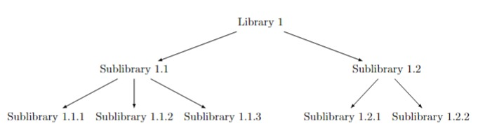
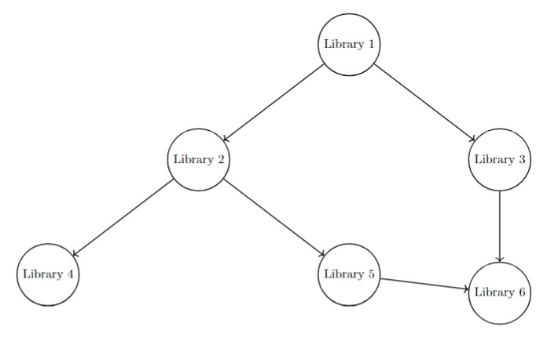

# Recursive Version Compatibility - Linear Programming Setting

**Kobe Team**  
*September, 2024*

## Abstract

In this problem, we aim to install several programming libraries, each with multiple versions. For each library, exactly one version must be selected, represented by binary decision variables. Additionally, libraries depend on sublibraries, forming a recursive structure where compatibility must also be ensured at each level. Libraries are assigned levels based on dependencies: main libraries are level 1, sublibraries needed by level 1 are level 2, and so on. Constraints are introduced to ensure compatibility not only among main libraries but also across the sublibraries. This problem is modeled using combinatorial linear programming with binary decision variables.

## Description of the Problem

Each library $i$ (where $i = 1, 2, \dots, N$) has multiple versions $1, 2, \dots, V_i$. The decision variable $X_{ij}$ represents whether version $j$ of library $i$ is selected for installation, with $X_{ij} = 1$ if version $j$ is selected, and $X_{ij} = 0$ otherwise.

We also assign levels to libraries: main libraries are at level 1, libraries needed by level 1 are at level 2, and this hierarchy continues recursively. For each library, we ensure that compatible versions are selected not only for the main libraries but also for all their required sublibraries.

The first constraint ensures that exactly one version is selected for each library, while the second ensures that incompatible versions from different libraries (and their sublibraries) are not installed together. The third constraint defines $X_{ij}$ as a binary decision variable.

## Dependency Tree

The following diagram shows the tree structure of library dependencies for a given library, where libraries in level 1 depend on libraries in level 2, and so on.

## Dependency Graph

The following diagram shows a small dependency graph where libraries depend on each other.

## Setting

We define the objective function to minimize the number of libraries installed, to avoid installing unnecessary libraries. Since there's a restriction to install all the level 1 libraries, this objective function doesn't avoid necessary libraries from being installed.

### Objective Function:

$$
\text{min} \quad Z = \sum_{i=1}^{N} \sum_{j=1}^{V_i} X_{ij}
$$

### Subject to the constraints:

$$
\begin{aligned}
    &\text{Constraint 1:} & \sum_{j=1}^{V_i} X_{ij} &= 1, & \forall i \in \{1, \dots, N\} \\
    &\text{Constraint 2:} & X_{ij} + X_{kl} &\leq 1, & \text{if versions } j \text{ and } l \text{ are incompatible, even at different levels} \\
    &\text{Constraint 3:} & X_{ij} &\in \{0, 1\}, & \forall i \in \{1, \dots, N\}, j \in \{1, \dots, V_i\}
\end{aligned}
$$

## Recursive Structure of Library Dependencies

We define the recursive structure of library dependencies as follows:

- $L_1$ represents the main set of libraries, i.e., $L_1 = \{1, 2, \dots, N\}$, where each library $i \in L_1$ is at level 1.
- For each library $i \in L_1$, let $S_i$ be the set of libraries that library $i$ depends on (i.e., sublibraries). We then define the set $L_2$ as the union of all $S_i$ for each $i \in L_1$:

$$
L_2 = \bigcup_{i \in L_1} S_i
$$

This process can be repeated recursively. For any level $k \geq 2$, the set $L_{k+1}$ is defined as the union of all sublibraries of the libraries in $L_k$:

$$
L_{k+1} = \bigcup_{i \in L_k} S_i
$$

This structure allows us to systematically assign levels to all libraries and ensure that sublibrary dependencies are respected throughout the recursive hierarchy.

## Setting of Decision Variables and Constraints for Sublibraries

### Decision Variables

$$
X_{ij}^{k} = 
\begin{cases}
1 & \text{if version } j \text{ of library } i \in L_k \text{ is selected}, \\
0 & \text{otherwise}
\end{cases}
$$

### Objective Function:

$$
\text{max} \quad Z = \sum_{k = 1}^{K} \sum_{i \in L_k} \sum_{j=1}^{V_i} X_{ij}^{k}
$$

This objective ensures that we are selecting one version of each library across all levels.

### Constraints:

1. **Single Version Selection per Library for Each Level:**

$$
\sum_{j=1}^{V_i} X_{ij}^{k} = 1, \quad \forall i \in L_k, \quad \forall k \geq 1
$$

2. **Incompatibility Constraints:**

$$
X_{ij}^{k} + X_{st}^{m} \leq 1, \quad \text{if version } j \text{ of library } i \in L_k \text{ is incompatible with version } t \text{ of library } s \in L_m, \quad k \neq m
$$

3. **Binary Decision Variables:**

$$
X_{ij}^{k} \in \{0, 1\}, \quad \forall i \in L_k, \forall j \in \{1, \dots, V_i\}, \forall k \geq 1
$$

This formulation captures the recursive structure of the problem, ensuring that sublibrary dependencies are respected across all levels.
